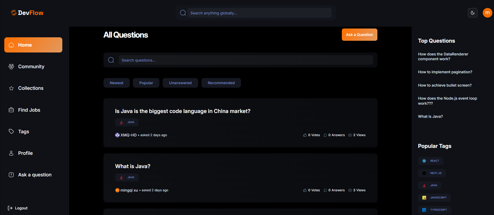
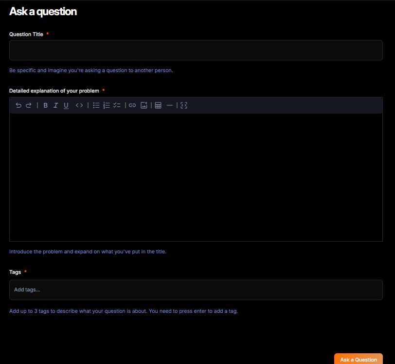
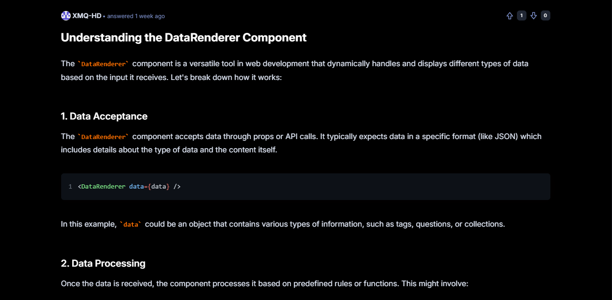

# 💻 DevFlow - Developer Community Platform

A modern full-stack web application inspired by Stack Overflow, built with **Next.js 15**, **MongoDB**, and **Tailwind CSS**. It enables developers to ask questions, share answers, vote, and grow their reputation within a collaborative community.

🔗 **Live Demo**: [https://next-js15-devflow-project.vercel.app/](https://next-js15-devflow-project.vercel.app/)

---

## 🧰 Tech Stack

### Frontend
- [x] Next.js 15 (App Router)
- [x] React 18
- [x] TypeScript
- [x] Tailwind CSS
- [x] ShadCN UI
- [x] Zustand (light state management)
- [x] React Hook Form
- [x] Markdown Editor with syntax support

### Backend
- [x] MongoDB (via Mongoose)
- [x] API Routes (Next.js handlers)
- [x] Clerk Authentication (OAuth + JWT)

### DevOps & Tools
- [x] Deployment: Vercel
- [x] Code Style: Prettier + ESLint
- [x] Version Control: Git + GitHub

---

## ✨ Features

- 🔐 **Authentication** with Clerk (Google OAuth and email)
- 📝 **Ask Questions** using a rich Markdown editor
- 💬 **Answer Questions** with voting and Markdown formatting
- 🔍 **Global Search** for questions by keyword
- 🏷️ **Tag System** for categorizing content
- ⭐ **Vote System** to upvote/downvote answers
- 🏅 **Reputation System** that reflects user engagement
- 👤 **User Profile Pages** showing asked/answered questions
- ⚡ **Optimized Rendering** with Next.js App Router

---

## 📸 Screenshots

You can add screenshots of your project here:

```markdown





This is a [Next.js](https://nextjs.org) project bootstrapped with [`create-next-app`](https://nextjs.org/docs/app/api-reference/cli/create-next-app).

## Getting Started

First, run the development server:

```bash
npm run dev
# or
yarn dev
# or
pnpm dev
# or
bun dev
```

Open [http://localhost:3000](http://localhost:3000) with your browser to see the result.

You can start editing the page by modifying `app/page.tsx`. The page auto-updates as you edit the file.

This project uses [`next/font`](https://nextjs.org/docs/app/building-your-application/optimizing/fonts) to automatically optimize and load [Geist](https://vercel.com/font), a new font family for Vercel.

## Learn More

To learn more about Next.js, take a look at the following resources:

- [Next.js Documentation](https://nextjs.org/docs) - learn about Next.js features and API.
- [Learn Next.js](https://nextjs.org/learn) - an interactive Next.js tutorial.

You can check out [the Next.js GitHub repository](https://github.com/vercel/next.js) - your feedback and contributions are welcome!

## Deploy on Vercel

The easiest way to deploy your Next.js app is to use the [Vercel Platform](https://vercel.com/new?utm_medium=default-template&filter=next.js&utm_source=create-next-app&utm_campaign=create-next-app-readme) from the creators of Next.js.

Check out our [Next.js deployment documentation](https://nextjs.org/docs/app/building-your-application/deploying) for more details.
